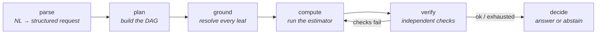

# Groundwork — numbers with receipts

*An agent that refuses to make up numbers. Every value it reports carries a receipt; when it can't ground an answer, it abstains instead of inventing one.*

[](https://github.com/doukhouhajar/numbers-with-receipts/actions/workflows/ci.yml)


---

## The thesis

Ask a language model a quantitative question and it will almost always give you a number — fluent, confident, and frequently wrong. The failure isn't that the number is off by a bit; it's that **there's no way to tell a computed number from a hallucinated one.** They look identical.

Groundwork makes that distinction structural. Every number in the system is a `Quantity` that must carry its **provenance** — where it came from:

| Provenance | Meaning | Requirement |
|------------|---------|-------------|
| `UserGiven` | the user supplied it | — |
| `Constant`  | a sourced value | must name its **source** (a citation) |
| `Derived`   | computed | must name its **method** and its **input** quantities |
| `Unknown`   | not grounded | must name a **reason**, and **cannot carry a value** |

That last row is the whole game. The type system enforces it:

```python
# This raises a ValidationError — it is unconstructable:
Quantity(name="physical_error_rate", value=1e-3,
         provenance=Unknown(reason="user never specified hardware"))
#   → "has a value but Unknown provenance,
#      this is exactly the hallucination we refuse to allow."
```

An `Answer` is likewise **answered-with-a-grounded-result** or **abstained-with-a-reason** — never both, never neither. A hallucinated answer isn't caught at runtime; it **fails to typecheck**. See [`groundwork/models.py`](groundwork/models.py) for the five invariants.

## How it works

A [LangGraph](https://github.com/langchain-ai/langgraph) agent runs six typed nodes. The number is built up a leaf at a time, each leaf grounded before anything is computed, and the result is re-checked before it's allowed out.



- **parse** — an LLM turns the question into a structured request. No LLM available? It falls back to a regex parser, so the pipeline still runs.
- **plan** — picks a recipe and lays out the computation DAG, tagging each leaf as *user input*, *published workload*, or *sourced constant*.
- **ground** — resolves the leaves. A missing required input becomes `Unknown` — the seed of an honest abstention.
- **compute** — runs the domain method (analytic formula or resource estimator) and tags the result `Derived`.
- **verify** — independent checks (below). Advisory checks annotate; blocking checks can force a recompute or an abstention.
- **decide** — assembles the `Derivation` and emits an `answered` or `abstained` `Answer`.

## The domain: quantum resource estimation

The spine is domain-agnostic; the wired-up domain is **fault-tolerant quantum resource estimation** — "how many physical qubits / how long to run algorithm X on hardware Y?" It's a good stress test: the numbers span many orders of magnitude, the literature disagrees, and a plausible-looking wrong answer is easy to produce.

Grounding sources, each receipted:

- **Analytic QEC formulas** — surface-code logical error rate `P_L ≈ a·(p/p_th)^((d+1)/2)`, required code distance (inverted and forward-verified), the `2d²` footprint, cycle time — each `code_ref`'d to Fowler et al. (2012) / the Azure QRE methodology.
- **Azure Quantum Resource Estimator** (`qsharp.estimate`) — full physical estimates from logical counts, run locally.
- **Published workloads** — logical qubit / Toffoli counts for named algorithms (e.g. RSA-2048 from Gidney 2025 and Gidney–Ekerå 2019), stored as `Constant`s with their citations.
- **Cross-method check** — [Qualtran](https://github.com/quantumlib/Qualtran) as a second, independent estimator; the two must agree within tolerance.

### A real worked example

The question *"my qubits have a 1e-3 error rate — what code distance do I need for a 1e-15 logical error rate?"* resolves entirely through the analytic path:

```
→ code_distance            27         computed via analytic:invert_surface_code_scaling
  physical_error_rate      0.001      given by user
  target_logical_error_rate 1e-15     given by user

  d = ceil(2·log(target/0.03)/log(p/0.01) − 1), rounded up to odd; verified forward.
  # Fowler, Mariantoni, Martinis, Cleland, Phys. Rev. A 86, 032324 (2012)

VERDICT  ANSWERED  code_distance = 27   (forward check: P_L = 3e-16 ≤ 1e-15 ✓)
```

Drop the target error rate from the question and it doesn't guess — it abstains: *"Cannot answer without: target_logical_error_rate — you did not specify target logical error rate; please provide it."*

## Verification layer

Grounding says a number *has* a source. Verification asks whether it's *right*. Each check is a `Check` with a severity ([`groundwork/verify.py`](groundwork/verify.py)):

| Check | Asks | Severity |
|-------|------|----------|
| **faithfulness** | re-execute the derivation — does it reproduce the stated value? | blocking |
| **dimensional** | do the units match the expected dimension? (via [Pint](https://pint.readthedocs.io)) | advisory |
| **magnitude** | is the value inside a physically plausible band? | advisory |
| **cross-method** | does an independent estimator (Qualtran) agree within tolerance? | advisory |

A failed **blocking** check triggers a recompute and, if unresolved, an abstention.

## Quickstart (5 minutes)

```bash
git clone https://github.com/doukhouhajar/numbers-with-receipts.git
cd numbers-with-receipts
python -m venv .venv && source .venv/bin/activate
pip install -e ".[dev]"          # add ".[dev,crossverify]" for the Qualtran cross-check
cp .env.example .env             # optional — see below

python demo.py                                   # the default worked example
python demo.py "How many physical qubits to factor RSA-2048?"
python demo.py --json "..."                      # structured Answer as JSON
```

**Config is all optional.** With an empty `.env` the agent still runs: the parser falls back to regex and tracing is disabled. To get the most out of it:

- **LLM parsing** — set `LLM_PROVIDER=ollama` with a local model (`ollama pull qwen3:8b`), *or* `LLM_PROVIDER=openai-compatible` pointed at any OpenAI-style endpoint (vLLM, a hosted API, …). See `.env.example`.
- **Sandboxed execution** — an `E2B_API_KEY` ([e2b.dev](https://e2b.dev)) for the code-execution tool.
- **Tracing** — Langfuse keys to get one span per node.

> **Hardware note.** The Azure estimator and a local LLM are the heavy parts. On a small laptop, run with the regex parser (no LLM) or point `LLM_PROVIDER` at a hosted endpoint — neither needs a GPU. A full local run with `qwen3:8b` wants a machine with real headroom.

## HTTP API

```bash
uvicorn groundwork.api:app --reload
```

- `POST /estimate` — `{"question": "..."}` → a structured `Answer` (result + full derivation + checks)
- `GET  /health` — liveness
- `GET  /docs` — OpenAPI UI

## Evals

An [Inspect](https://inspect.aisi.org.uk/) harness ([`evals/eval.py`](evals/eval.py)) scores the agent on curated sets — `answerable`, `underspecified`, `unit_traps`, `magnitude_traps` — measuring grounded accuracy, appropriate-abstention rate, and hallucination rate.

```bash
inspect eval evals/eval.py
```

Note that hallucination is bounded *by construction*, not just empirically: an `answered` `Answer` with an ungrounded result cannot be built. The eval measures the harder axis — whether the agent abstains too much or too little.

## Project layout

```
groundwork/
  models.py    # the typed spine: Quantity, Provenance, Derivation, Answer + invariants
  agent.py     # LangGraph graph: parse → plan → ground → compute → verify → decide
  domain.py    # quantum RE: analytic formulas, Azure QRE wrapper, published workloads
  verify.py    # faithfulness / dimensional / magnitude / cross-method checks
  tools.py     # Pint unit registry, sourced-constant lookup, E2B sandbox
  config.py    # pydantic-settings; LLM + tracing wiring
  api.py       # FastAPI service
demo.py        # pretty-printed end-to-end run
evals/         # Inspect tasks + datasets
tests/         # provenance-invariant tests
```

## Status

Working: the typed spine and its invariants, the full six-node graph, analytic + estimator grounding, abstention on underspecified inputs, the four verification checks, the Inspect eval harness, and the FastAPI service.

Next: uncertainty propagation (`uncertainties`), config-driven answer/abstain thresholds, and a deployed public endpoint.

## License

MIT
